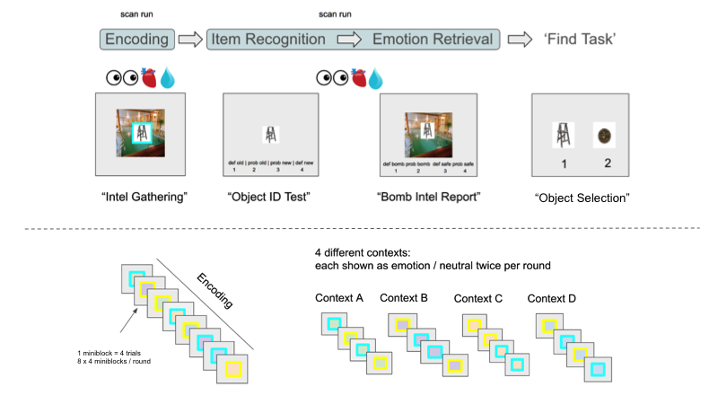
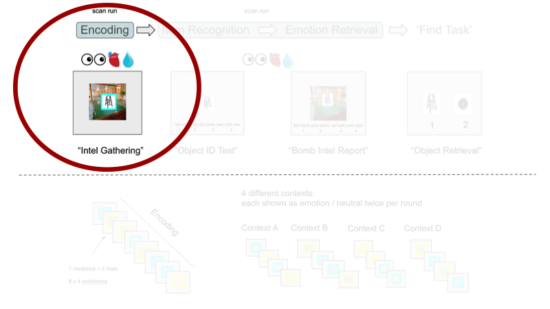
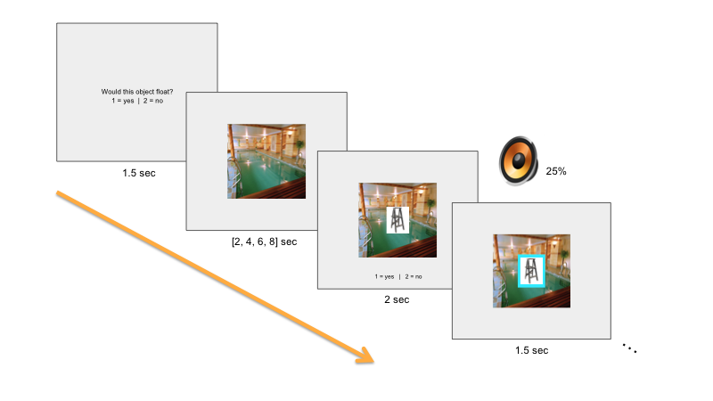
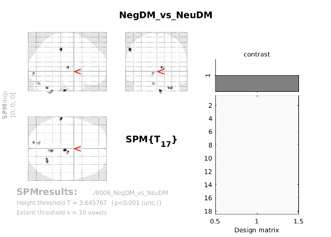
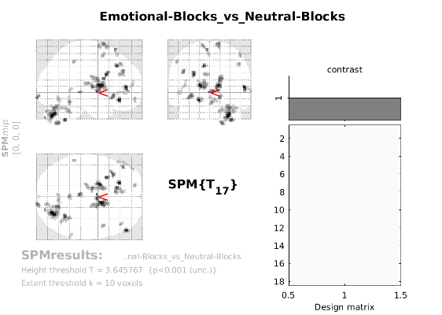

<link rel="stylesheet" type="text/css" href="papaya.css?build=1432" />
<script type="text/javascript" src="papaya.js?build=1432"></script>
<script src="https://ajax.googleapis.com/ajax/libs/jquery/1.11.3/jquery.min.js"></script>

## Experimental Design | Overview

<div class="midcenter" style="margin-left:-400px; margin-top:-150px; background-color:transparent;">
  </img>
</div>

<div class="notes">

Today I will be presenting the results of an analysis that I ran on MICE Encoding. This will be a sneak peak at a poster I will be presenting on for CNS in a month or so.

Before we begin, lets refresh our memory of the experimental design!

In MICE, 30 participants were asked to become secret agents! As secret agents, they were assigned to complete 4 tasks:

- An **encoding task**, where participants visited 4 different contexts and encountered pictures of everyday, neutral items. Participants visited each context twice during each scanning run, once during which the context was a "bomb" context and once during which the context was a "safe" context. "Bomb" items were accompanied by a 25% chance of hearing a startling burst of white noise and "safe" objects were accomapnied by a 25%

</div>

## Experimental Design | Overview

<div class="midcenter" style="margin-left:-400px; margin-top:-150px; background-color:transparent;">
  </img>
</div>

<div class="notes">

The results I will be presenting today are from the **Encoding** portion of the experiment.

</div>

## Encoding Task | Trial Overview

<div class="midcenter" style="margin-left:-400px; margin-top:-150px; background-color:transparent;">
  </img>
</div>

<div class="notes">

- 4 Background Contexts
- Mini-blocks consisting of 4 items on the same background
- "Bomb" and "Safe" designation orthogonal to background context
- "Bomb" designation consisted of a 25% chance of hearing a burst of **white noise**.
- "Safe" designation consisted of a 25% chance of hearing a **neutral tone**.

</div>

----

<iframe width="400" height="400" src="https://www.youtube.com/embed/8FUjjvmPsho?rel=0" frameborder="0" allow="autoplay; encrypted-media" allowfullscreen></iframe>

<div class="notes">

- 4 Background Contexts
- Mini-blocks consisting of 4 items on the same background
- "Bomb" and "Safe" designation orthogonal to background context
- "Bomb" designation consisted of a 25% chance of hearing a burst of **white noise**.
- "Safe" designation consisted of a 25% chance of hearing a **neutral tone**.

</div>

## Questions

- What are the _sustained_ neural correlates supporting emotional/neutral encoding?
- What are the _transient_ neural correlates supporting emotional/neutral encoding?
- How do these neural correlates relate to subsequent memory for item-emotion association?

## Hypotheses

- What are the _sustained_ neural correlates supporting encoding in a threatening/safe context?
    - Hippocampus (HIPP)
    - Caudate Nucleous (Caudate)
    - Others?
- What are the _transient_ neural correlates supporting emotional/neutral encoding?
    - Amygdala (AMY)
    - Peririnal Cortext (PRC)
    - Others?
- How do these neural correlates relate to subsequent emotional memory?

## Hypotheses | Sustained

- Past research suggests that the **Hippocampus** is key for encoding context
    - Particularly visual-spatial context
- Past reearch suggests that the **Caudate Nucleous** is active when encountering a threatening context.
    - Threat of shock, Uncertainty
- Others brain areas?
    - 

## Hypotheses | Transient

- Past research implicates the **Amygdala** in the perception of salient features  
    - Faces, pictures, objects, task-relevant  
- Past research implicates the **Pererihinal Cortex** in the encoding and retrieval of item information  
    - Faces, pictures, objects, task-relevant  
    
## Hypotheses | DM Effects

- Do any of the above mentioned neural correlates change as a function of subsequent item-emotion association retrieval success?

## Modeling

To answer these questions, we created a GLM that:

- ...captures both **sustained** BOLD responses over the course of Mini-blocks and **transient** BOLD responses to individual stimuli.

- ...captures neural correlates that vary as a function of subsequent memory (i.e., a **difference in memory**  effect).

## Modeling | Design Matrix

```{r echo=FALSE,warning=FALSE,message=FALSE,fig.align='center'}
require(tidyverse)
require(reshape2)
example_design_matrix <- as.matrix(read.csv('data/sub-s003-design-matrix.csv'))
row.names(example_design_matrix) <- seq(1, nrow(example_design_matrix), 1)
colnames(example_design_matrix) <- c("Emo-MBs", "Neu-MBs", #mini-blocks
                                      "All-Trials","SubEmoMem","SubNeuMem", #trials
                                      "x", "y", "z", #translation
                                      "pitch", "roll", "yaw", #rotation
                                      "run1-HPF1", "run1-HPF2", "run1-HPF3", #run1
                                      "run2-HPF1", "run2-HPF2", "run2-HPF3", #run2
                                      "run3-HPF1", "run3-HPF2", "run3-HPF3", #run3
                                      "run4-HPF1", "run4-HPF2", "run4-HPF3", #run4
                                      "run5-HPF1", "run5-HPF2", "run5-HPF3", #run5
                                      "run6-HPF1", "run6-HPF2", "run6-HPF3", #run6
                                      "run1-constant", "run2-constant", #run-constants
                                      "run3-constant", "run4-constant", #run-constants
                                      "run5-constant", "run6-constant", #run-constants
                                      "constant" #experiment-wide-constant
                                      )

long.data <- melt(example_design_matrix, varnames = c("Scan", "Regressor"))

ggplot(long.data, aes(x = Regressor, y = Scan)) + 
  geom_raster(aes(fill=value)) + 
  scale_x_discrete(position = "top") +
  scale_fill_continuous(guide = FALSE) +
  scale_y_continuous(trans = "reverse", breaks = seq(0,990,165)) +
  theme(axis.text.x=element_text(size=8, angle=90, vjust=0.3, hjust = 0),
        axis.text.y=element_text(size=9),
        plot.title=element_text(size=11),
        panel.grid=element_blank(),
        panel.background=element_blank(),
        axis.ticks.x = element_line()) +
  labs(title = "Example Design Matrix")
```

<!-- ## Modeling | DM Parametric Modulators -->

<!-- - Two **Subseqeuent Emotional Memory Scores** were entered in as a parametric modulators of our transient "All Trials" regressor.   -->
<!-- - Each encoding trial recieved a Neutral Subsequent Memory Score and an Emotional Subsequent Memory score, which were calculated as follows: -->

## Modeling | DM Parametric Modulators

- _Negative_ Subsequent Memory Score:
    - IFF bomb object:
        - Score 4: Def Bomb (i.e., HC Hit)
        - Score 3: Prob Bomb (i.e, LC Hit)
        - Score 2: Prob Safe (i.e., LC Miss)
        - Score 1: Def Safe (i.e., HC Miss)
    - IFF safe object:
        - Average Negative Subsequent Memory Score

## Modeling | DM Parametric Modulators


- _Neutral_ Subsequent Memory Score:
    - IFF safe object:
        - Score 4: Def Safe (i.e., HC Hit)
        - Score 3: Prob Safe (i.e., LC Hit)
        - Score 2: Prob Bomb (i.e., LC Miss)
        - Score 1: Def Bomb (i.e., HC Miss)
    - IFF bomb object:
        - Average Neutral Subsequent Memory Score

## Modeling | DM Parametric Modulators

-  Note: We dropped participants with < 10 high confidence emotional hits (def bomb | bomb) OR < 10 high confidence neutral hits (def safe | safe), leaving an **n = 18**. 

# Results

## Results | Outline

- Transient DM Effects
    - MTL ROIs
    - Outside of MTL (Whole Brain)
- Sustained Effects
    - MTL ROIs
    - Outside of the MTL (Whole Brain)

## Results | MTL ROIs

<script type="text/javascript">

var params = [];

params["images"] = ["./ROIs/icbm_avg_152_t1_tal_nlin_symmetric_VI.nii", "./ROIs/rAMY_L_mask.nii", "./ROIs/rAMY_R_mask.nii", "./ROIs/rPRC_L_mask.nii", "./ROIs/rPRC_R_mask.nii", "./ROIs/rHIPP_BODY_L_mask.nii", "./ROIs/rHIPP_BODY_R_mask.nii"];

params["luts"] = [{"name": "Reda", "data":[[0, 0.973, 0.463, 0.427], [.5, 0.973, 0.463, 0.427], [1, 0.973, 0.463, 0.427]], "gradation": "constant"}, {"name": "Redb", "data":[[0, .804, .588, 0], [.5, .804, .588, 0], [1, .804, .588, 0]], "gradation": "constant"}, {"name": "Greena", "data":[[0, 0.486, 0.682, 0.000], [.5, 0.486, 0.682, 0.000], [1, 0.486, 0.682, 0.000]], "gradation": "constant"}, {"name": "Greenb", "data":[[0, 0.000, 0.745, 0.404], [.5, 0.000, 0.745, 0.404], [1, 0.000, 0.745, 0.404]], "gradation": "constant"}, {"name": "Bluea", "data":[[0, 0.000, 0.749, 0.769], [.5, 0.000, 0.749, 0.769], [1, 0.000, 0.749, 0.769]], "gradation": "constant"}, {"name": "Blueb", "data":[[0, 0.000, 0.663, 1.000], [.5, 0.000, 0.663, 1.000], [1, 0.000, 0.663, 1.000]], "gradation": "constant"}, {"name": "Purplea", "data":[[0, 0.780, 0.486, 1.000], [.5, 0.780, 0.486, 1.000], [1, 0.780, 0.486, 1.000]], "gradation": "constant"}, {"name": "Purpleb", "data":[[0, 1.00, 0.38, 0.80], [.5, 1.00, 0.38, 0.80], [1, 1.00, 0.38, 0.80]], "gradation": "constant"}];

params["rAMY_L_mask.nii"]  = {lut:"Reda"};
params["rAMY_R_mask.nii"]  = {lut:"Redb"};
params["rPRC_L_mask.nii"]  = {lut:"Purplea"};
params["rPRC_R_mask.nii"]  = {lut:"Purpleb"};    
params["rHIPP_BODY_L_mask.nii"]  = {lut:"Greena"};
params["rHIPP_BODY_R_mask.nii"]  = {lut:"Greenb"};

params["worldSpace"] = true;
params["showControls"] = false;
params["allowScroll"] = false;

</script>

<div class="midcenter" style="width:600px; height:600px; margin-left:-300px; margin-top:-200px;">
  <div class="papaya" data-params="params"></div>
</div>

# Results | Transient DM Effects

```{r echo=FALSE,warning=FALSE,message=FALSE}
require(tidyverse)
require(scales)
df <- read.csv('data/roi-results.csv')

df %>%
  mutate(hemisphere = ifelse(grepl("[L]{1}", roi_name), "L", ifelse(grepl("[R]{1}", roi_name), "R", NA)),
         hemisphere = ifelse(hemisphere == "L", "Left", ifelse(hemisphere == "R", "Right", NA)),
         hemisphere = factor(hemisphere),
         region     = roi_name,
         region     = sub("^r", "", region),
         region     = sub("_[LR]{1}_mask$", "", region),
         region     = factor(region, levels = c("AMY", "PRC", "HIPP_BODY", "PHC_ANT"))
         ) %>% 
  filter(con_name != "Trials") %>%
  filter(region != "PHC_ANT") -> df
```

## Transient DM Effects | MTL

```{r, echo=FALSE,warning=FALSE,message=FALSE,fig.align='center'}
require(ggsignif)

annotation.df <- data.frame(hemisphere=c("Left", "Right"), 
                            region=c("PRC","PRC"),
                            start=c("NegDM", "NegDM"), 
                            end=c("NeuDM", "NeuDM"),
                            y=c(.4, .4),
                            label=c("~", "*"))

ann_text1 <- data.frame(con_name = "NegDM", summary_value = .25, lab = "**",
                       hemisphere = factor("Left", levels = c("Left", "Right")),
                       region = factor("PRC", levels = levels(df$region)))

ann_text2 <- data.frame(con_name = "NegDM", summary_value = .3, lab = "***",
                       hemisphere = factor("Right", levels = c("Left", "Right")),
                       region = factor("PRC", levels = levels(df$region)))


df %>%
  filter(!grepl("CAUDATE", roi_name)) %>%
  ggplot(aes(x = con_name, y = summary_value, fill = con_name)) +
    geom_bar(stat = "summary", 
             fun.y = "mean") +
    geom_errorbar(stat = "summary", 
                  fun.data = "mean_se", 
                  width = 0.2) +
    geom_signif(data=annotation.df,
                aes(xmin=start, xmax=end, annotations=label, y_position=y, fill=NULL),
                vjust = -.1,
                manual = TRUE) + # cross bar significance
    geom_text(data=ann_text1, aes(label = lab, fill=NULL)) +
    geom_text(data=ann_text2, aes(label = lab, fill=NULL)) +   
    facet_grid(hemisphere~region) +
    theme(axis.text.x = element_text(angle = 45, hjust = 1)) +
    labs(y = "Mean Beta Value", 
         x = "Parameter",
         title = "Transient DM Effects", 
         subtitle = "MTL ROIs",
         caption = "~ = p<.06\n* = p<.05\n** = p<.01\n*** = p < .001") +
    scale_x_discrete(limits = c("NegDM", "NeuDM")) +
    scale_fill_manual(guide=FALSE, values = c("#de2d26", "#3182bd")) +
    coord_cartesian(ylim = c(-.1, .45))  
```

```{r echo=FALSE, warning=FALSE, message=FALSE, results='hide'}
require(ez)
# Parameter x Region x Hemisphere ANOVA
df %>%
  filter(!grepl("Blocks", con_name)) %>%
ezANOVA(dv = summary_value
        , wid = subject_id
        , within = .(con_name, region, hemisphere)
) %>%
  print()

# Follow up Parameter x Hemisphere ANOVA in the PRC
df %>%
  filter(!grepl("Blocks", con_name)) %>%
  filter(grepl("PRC", region)) %>%
ezANOVA(dv = summary_value
        , wid = subject_id
        , within = .(con_name, hemisphere)
) %>%
  print()


# Follow up t-tests in the code chunk confirm the custom annotations in the figure above

# test 1: NegDM != NegDM (paired) for Left PRC
t.test(summary_value ~ con_name, 
       data=df, 
       subset = grepl("DM", df$con_name) & df$roi_name == "rPRC_L_mask", 
       paired=TRUE)

# test 2: NegDM != NegDM (paired) for Right PRC
t.test(summary_value ~ con_name, 
       data=df, 
       subset = grepl("DM", df$con_name) & df$roi_name == "rPRC_R_mask", 
       paired=TRUE)

# test 3: NegDM != 0 (one-sample) for Left PRC
t.test(x = df$summary_value[df$roi_name == "rPRC_L_mask" & df$con_name == "NegDM"], mu = 0)

# test 4: NegDM != 0 (one-sample) for Right PRC
t.test(x = df$summary_value[df$roi_name == "rPRC_R_mask" & df$con_name == "NegDM"], mu = 0)

```

## Transient DM Effects | Outside MTL

<div class="columns-2">
  

  - Whole brain results; p<.001 (unc.) k=10
  - Not much survives a liberal uncorrected threshold
  - Looks like Cerebellum, Visual, Superior Frontal
  
</div>

# Results | Sustained Encoding

## Sustained | MTL

```{r echo=FALSE,warning=FALSE,message=FALSE,fig.align='center'}
df %>%
  filter(!grepl("CAUDATE", roi_name)) %>%
  ggplot(aes(x = con_name, y = summary_value, fill = con_name)) +
    geom_bar(stat = "summary", 
             fun.y = "mean") +
    geom_errorbar(stat = "summary", 
                  fun.data = "mean_se", 
                  width = 0.2) +
    facet_grid(hemisphere~region) +
    theme(axis.text.x = element_text(angle = 45, hjust = 1)) +
    labs(y = "Mean Beta Value", 
         x = "Parameter",
         title = "MTL Summary") +
    scale_x_discrete(limits = c("Emotional-Blocks", "Neutral-Blocks")) +
    scale_fill_discrete(guide=FALSE)
```

## Sustained | Outside MTL

<div class="columns-2">
  

  - Whole brain results; p<.001 (unc.) k=10
  
</div>